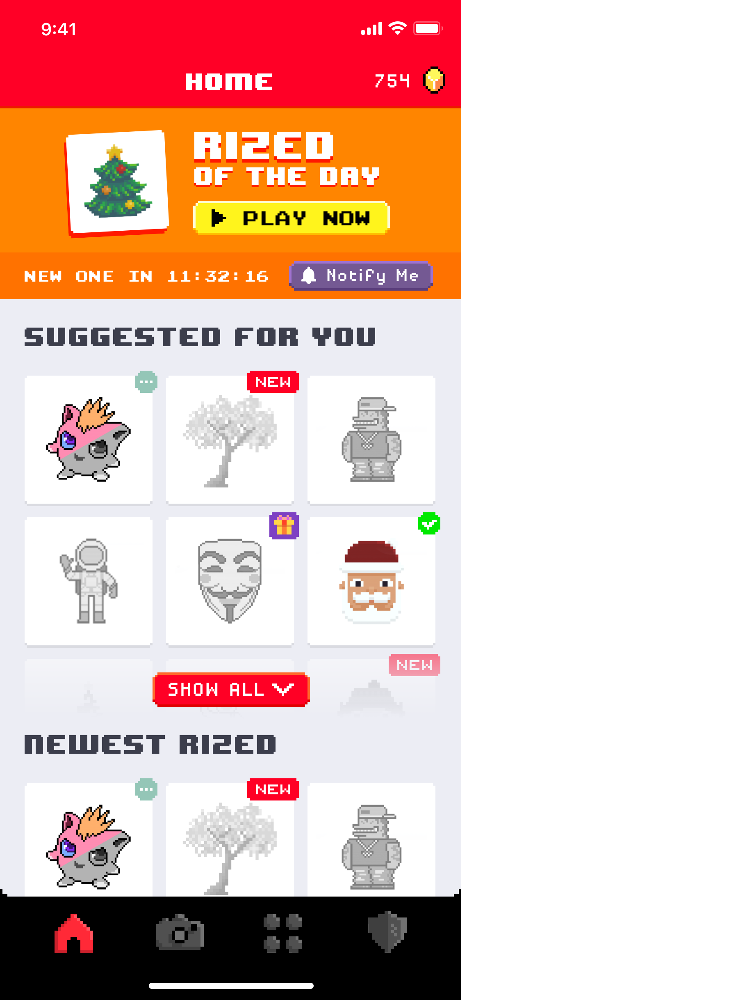

# _**Collection View**_

Tips & Tricks
---

---
**What?** 🧐
---

^
Not covered:
    - animations between collections
    - iOS11 APIs
    - prefetching APIs
    - supplementary views

---
**Why?** 🤔
---

---
**Collection Views, the basics** 👶
---
___

> An object that manages an ordered collection of data items and presents them using customizable layouts.
-- Apple Documentation

---

^
We also have supplementary views that are, ...
For instance if this view would be implemented in a diferent way, ...

---

---

---

---

---
# **Layout** 📐
 
> The job of a layout object is to determine the placement of cells, supplementary views, and decoration views inside the collection view’s bounds and to report that information to the collection view when asked. The collection view then applies the provided layout information to the corresponding views so that they can be presented onscreen.
-- Apple Documentation

---

---

---

^
return all the attributes for a given rect
no assumption on the rect
right place to add new things to the layout (mainly decoration views)

---

^
Do not use it for supplementary views or decoration views.

---

---

---

# **UICollectionViewFlowLayout** 📐
 
> You must subclass UICollectionViewLayout in order to use it. Before you consider subclassing, though, you should look at the UICollectionViewFlowLayout class to see if it can be adapted to your layout needs.
-- Apple Documentation

^
Most of the use cases we have can be achieved by subclassing flow layout

^
If you have to do something redically different, consider use UICollectionViewLayout. But this can be challenging (depending on your layout)

---

# **Links** 🔗

* https://developer.apple.com/documentation/uikit/uicollectionviewlayout

* https://developer.apple.com/library/content/documentation/WindowsViews/Conceptual/CollectionViewPGforIOS/CreatingCustomLayouts/CreatingCustomLayouts.html

* https://www.objc.io/issues/5-ios7/collection-views-and-uidynamics/
